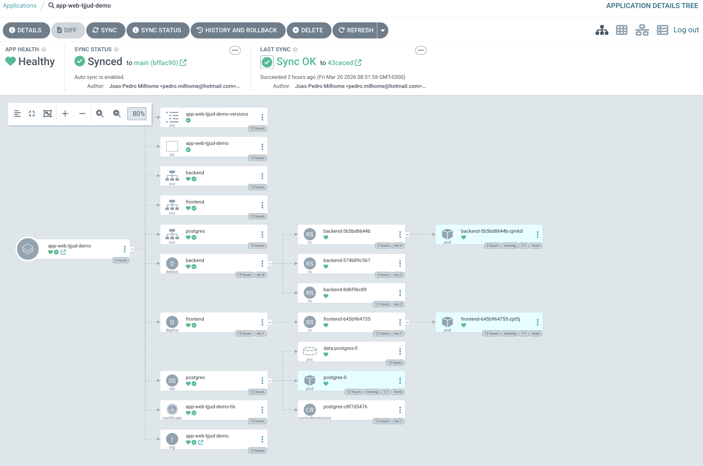

# GitOps e Demo

## Estado desejado

O ambiente demo e gerenciado por Argo CD, com sincronizacao automatica do repositorio Git.

- `Application`: `app-web-tjjud-demo`
- `AppProject`: `app-web-tjjud`
- `targetRevision`: `main`
- `path`: `k8s/demo`

## Recursos principais

- `ConfigMap` com as versoes implantadas
- `Namespace` dedicado da demo
- `Deployment` e `Service` do backend
- `Deployment` e `Service` do frontend
- `StatefulSet`, `Service` e `PVC` do PostgreSQL
- `Certificate` e `Ingress` do ambiente publicado

## Enderecos e componentes

- frontend publico: [https://front-demo.pavim.com.br](https://front-demo.pavim.com.br)
- documentacao publica: [https://jpmmdf.github.io/app-web-tjjud/](https://jpmmdf.github.io/app-web-tjjud/)
- manifests da demo: `k8s/demo`
- manifests do Argo: `k8s/argocd`

## Observacao sobre o health do Argo

O cluster usa Traefik sem preencher `status.loadBalancer.ingress` no `Ingress`.
Por isso, o repositrio versiona uma customizacao de health em `k8s/argocd/argocd-cm-ingress-health.yaml` para que o Argo considere esse `Ingress` como saudavel quando ele estiver corretamente configurado.
